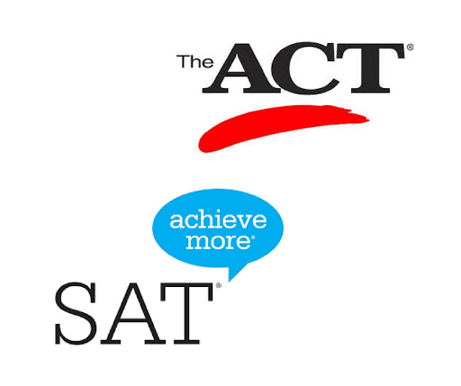

 
# Analysis of SAT & ACT scores across US states

## Problem Statement
Analyze trends in SAT & ACT data from 2017 & 2018 and make recommendations to increase participation in the SATs of one particular state

 

## Executive Summary
The new format for the SAT was released in March 2016. As part of College Board - the organization that administers the SAT - our team has tracked statewide participation to make recommendations where money should be best spent to improve SAT participation rates. This report uses the provided data and outside research to propose how College Board might work to increase the participation rate in the <b>state of Virginia</b>.

<u>Here are some key findings:</u>

1) A higher participation rate can only be achieved by the state making either test mandatory and providing the necessary funding to make it affordable for students.
* For example, Ohio state had made either ACT or SAT compulsory for high school students. This resulted both test participation rates to increase YOY.
    
2) Overall SAT scores improved in year 2018 despite the higher participation rate comparing to previous year, while ACT score remains relatively stable.

3) Factors such as choosing to go to a neighbouring state influenced the preference between SAT and ACT.
* For example, in South and North Carolina, even though they had 100 % ACT participation due to state funding, their SAT participation was above 50%, indicating that students were preparing to enrol in colleges in the upper East Coast

 

## Data Dictionary for Final Dataset
(Datasets can be found in data directory)	

|Feature|Type|Description|
|-------|----|------------|
|state| object | States that participated in the ACT/SAT
|sat2017_participation | int64  | State participation rates (%)
|sat2017_rw          |   int64  | Average Evidence-Based Reading and Writing Score which ranges between 200 and 800
|sat2017_math         |   int64  | Average Math Score which ranges between 200 and 800
|sat2017_total        |   int64  | Average Total Score that aggregates Reading and Writing and Math Scores, ranges between 400 and 1600|
|act2017_participation |  int64  | State participation rates (%)
|act2017_english      |   float64| Average English Score which ranges between 1 and 36
|act2017_math        |    float64| Average Math Score which ranges between 1 and 36
|act2017_reading     |    float64| Average Reading Score which ranges between 1 and 36
|act2017_science    |    float64| Average Science Score which ranges between 1 and 36
|act2017_composite  |     float64| Average Composite Score which ranges between 1 and 36
|act2018_participation|   int64  | State participation rates (%)
|act2018_composite   |   float64| Average Composite Score which ranges between 1 and 36
|act2018_english     |   float64| Average English Score which ranges between 1 and 36
|act2018_math         |  float64| Average Math Score which ranges between 1 and 36
|act2018_reading      |  float64| Average Reading Score which ranges between 1 and 36
|act2018_science      |  float64| Average Science Score which ranges between 1 and 36
|sat2018_participation | int64  | State participation rates (%)
|sat2018_rw           |  int64  | Average Evidence-Based Reading and Writing Score which ranges between 200 and 800
|sat2018_math         |  int64  | Average Math Score which ranges between 200 and 800
|sat2018_total   | int64 | Average Total Score that aggregates Reading and Writing and Math Scores, ranges between 400 and 1600|

## Process flow:
- 2017 Data Import & Cleaning
- 2018 Data Import and Cleaning
- Exploratory Data Analysis
- Data Visualization
- Descriptive and Inferential Statistics
- Outside Research
- Conclusions and Recommendations
 
 

## Recommendation:
The state of Virginia currently neither has a requirement for either test nor does it fund students to take up any of the tests. Given that there is a strong inclination towards SAT in the state as well as a higher graduand rate of high school students, I would recommend College Board approach a partnership with the <b>state of Virgina</b> to promote the SATs through the following actions:

1) Comparing the [costs of each test](https://www.vox.com/the-goods/2019/3/28/18282453/sat-act-college-admission-testing-cost-price), the SAT is fiscally more sound for the state of Virginia to sponsor all high school students.

2) Create digital prep workshops or seminars to increase the student interest in the SAT and [hear success stories] from SAT alumni.(https://www.prepscholar.com/act/s/case_studies)

3) Encouraging Virginia colleges to offer SAT sponsorships

 

##### ≈≈≈≈≈  Further investigation required: ≈≈≈≈≈
More details are required through on ground surveys, regarding the college preferences of Virginia students to confirm if students would tend to enrol in colleges within Virginia or the upper east coast.
