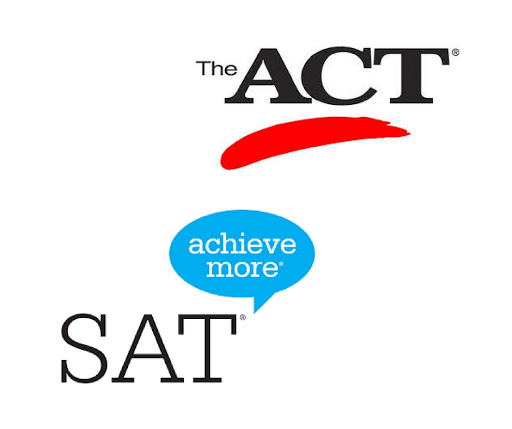

 
# Project 1: Analysis of SAT & ACT scores across US states

## Problem Statement
Analyze trends in SAT & ACT data from 2017 - 2018 and make recommendations to increase participation in at least one state.

## Executive Summary
This study examines the state scores and other external data to determine the various factors that influence the participation rates across states.

<u>Here are some key findings:</u>

1) A 100% participation rate can only be acheived by the state making either test mandatory and providing the necessary funding to make it affordable for students.
    -  For example, Ohio state had made either ACT or SAT compulsory for high school students. This resulted both test participation rates to increase.

2) Overall SAT scores improved in year 2018 despite the higher participation rate comparing to previous year, while ACT score remains relatively stable.

3) The cost of SAT test is relatively high comparing to ACT test which might affect which tests states would sponsor.

## Contents:
- 2017 Data Import & Cleaning
- 2018 Data Import and Cleaning
- Exploratory Data Analysis
- Data Visualization
- Descriptive and Inferential Statistics
- Outside Research
- Conclusions and Recommendations